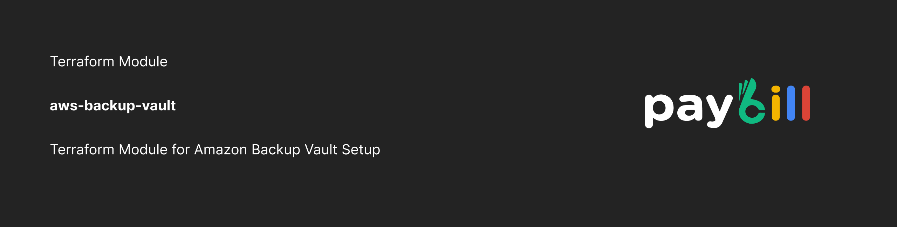

  <a href="https://paybill.dev" target="_blank">
    <picture>
      
    </picture>
  </a>

# AWS Backup Vault with KMS Encryption Terraform Module

This Terraform module creates an **AWS Backup Vault** with optional **KMS encryption** and manages the necessary IAM roles and key policies for secure backup operations.

## Features

* Creates an **AWS KMS key** for encrypting backups (optional, configurable via `enable_encryption`).
* Creates a **Backup Vault** using the KMS key if encryption is enabled.
* Configures KMS key policies to allow:

  * Full administrative access to specified IAM roles and root account.
  * Backup operations by a specified IAM role.
* Outputs the **ARN of the backup vault** for easy integration with other resources.
* Supports tagging of both the KMS key and the backup vault.

<!-- BEGIN_TF_DOCS -->
## Requirements

| Name | Version |
|------|---------|
|  [terraform](#requirement\_terraform) | >= 1.5.0 |
|  [aws](#requirement\_aws) | >= 4.0, < 6.0.0 |

## Providers

| Name | Version |
|------|---------|
|  [aws](#provider\_aws) | >= 4.0, < 6.0.0 |

## Modules

No modules.

## Resources

| Name | Type |
|------|------|
| [aws_backup_vault.this](https://registry.terraform.io/providers/hashicorp/aws/latest/docs/resources/backup_vault) | resource |
| [aws_kms_key.this](https://registry.terraform.io/providers/hashicorp/aws/latest/docs/resources/kms_key) | resource |
| [aws_caller_identity.current](https://registry.terraform.io/providers/hashicorp/aws/latest/docs/data-sources/caller_identity) | data source |
| [aws_iam_policy_document.this](https://registry.terraform.io/providers/hashicorp/aws/latest/docs/data-sources/iam_policy_document) | data source |
| [aws_iam_role.this](https://registry.terraform.io/providers/hashicorp/aws/latest/docs/data-sources/iam_role) | data source |

## Inputs

| Name | Description | Type | Default | Required |
|------|-------------|------|---------|:--------:|
|  [backup\_role\_name](#input\_backup\_role\_name) | IAM role used to take backup of AWS resources | `string` | n/a | yes |
|  [enable\_encryption](#input\_enable\_encryption) | Whether to enable encryption | `bool` | `true` | no |
|  [kms\_key\_admin\_arns](#input\_kms\_key\_admin\_arns) | Additional IAM roles to map to the KMS key policy for administering the KMS key used for SSE. | `list(string)` | `[]` | no |
|  [kms\_key\_deletion\_window\_in\_days](#input\_kms\_key\_deletion\_window\_in\_days) | Deletion window for KMS key in days. | `number` | `10` | no |
|  [name](#input\_name) | Name of backup vault | `string` | n/a | yes |
|  [tags](#input\_tags) | Tags for AWS backup service | `map(string)` | n/a | yes |

## Outputs

| Name | Description |
|------|-------------|
|  [arn](#output\_arn) | ARN of Vault |
<!-- END_TF_DOCS -->